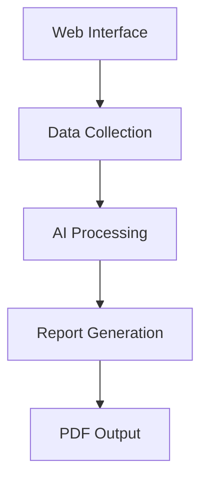

<div align="center">
  

  # ResearchAI 🤖
  
  <p>An AI-powered research report generator combining web scraping, NLP, and document generation.</p>

  [](https://www.python.org/)
  [](https://flask.palletsprojects.com/)
  [](https://deepmind.google/technologies/gemini/)
  [](https://opensource.org/licenses/MIT)
</div>

## ✨ Features

- 🔍 Multi-source web scraping
- 🧠 AI-powered text analysis
- 📊 Automated data visualization
- 📝 Dynamic PDF report generation
- 📈 Trend analysis and insights
- 🔄 Real-time data processing

## 🚀 Tech Stack

### Backend
-  Python 3.8+
-  Flask
-  Selenium
-  NLTK

### AI/ML
-  Google Gemini API
-  TextBlob
-  Pandas

### Frontend
-  HTML5
-  CSS3
-  JavaScript

## 📦 Installation

```bash
# Clone repository
git clone https://github.com/yourusername/reserchai.git

# Create virtual environment
python -m venv venv
source venv/bin/activate  # Linux/Mac
venv\Scripts\activate     # Windows

# Install dependencies
pip install -r requirements.txt

# Set environment variables
export GEMINI_API_KEY="your-api-key"
export NEWS_API_KEY="your-api-key"

# Run application
python app.py
```

## 🌐 Usage

1. Start the server
2. Navigate to `http://localhost:5000`
3. Enter research topic
4. Click "Generate Report"
5. Download PDF report

## 📊 Architecture



## 📸 Screenshots

<div align="center">
  
  <p><em>Modern user interface for research topic input</em></p>
</div>

## 🛠️ Development

```bash
# Run tests
python -m pytest

# Run linting
flake8 .

# Generate documentation
pdoc --html .
```

## 🤝 Contributing

1. Fork repository
2. Create feature branch (`git checkout -b feature/amazing-feature`)
3. Commit changes (`git commit -m 'Add amazing feature'`)
4. Push to branch (`git push origin feature/amazing-feature`)
5. Open Pull Request

## 📄 License

MIT License - see [LICENSE](LICENSE) for details

## 👥 Team

- Lead Developer - [@dev_lead](https://github.com/dev_lead)
- ML Engineer - [@ml_expert](https://github.com/ml_expert)
- Frontend Dev - [@frontend_dev](https://github.com/frontend_dev)

## 🌟 Acknowledgments

- Google Gemini API
- NewsAPI
- Open source community

---
<div align="center">
  Made with ❤️ by ResearchAI Team
  
  [](https://twitter.com/reserchai)
  [](https://github.com/yourusername/reserchai)
</div>
